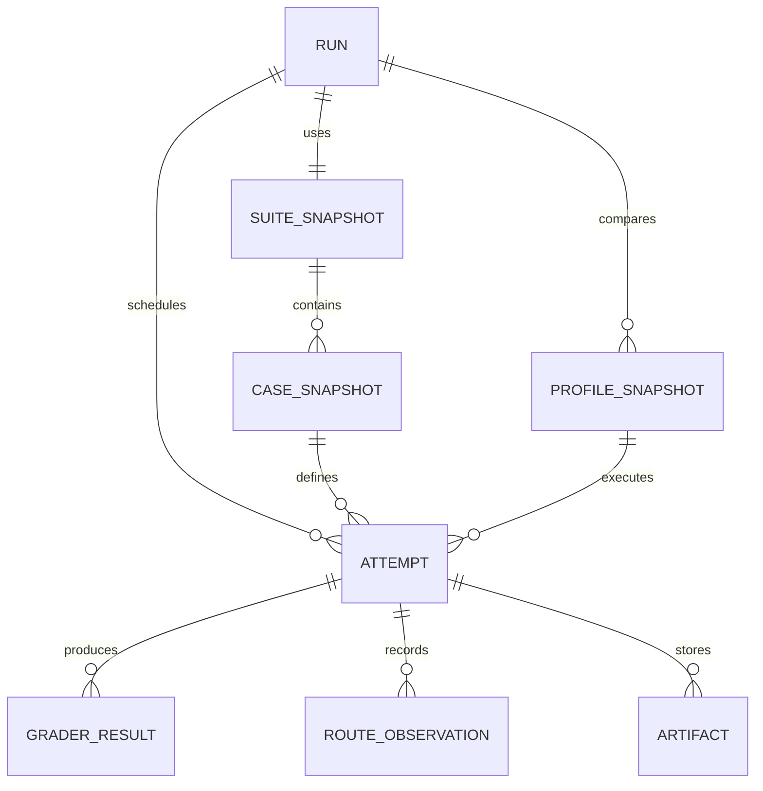

# Data and API Specification

## 1. Principles

- SQLite is the source of truth for run and attempt summaries.
- Raw event streams and large logs are filesystem artifacts referenced by relative path and hash.
- Every aggregate displayed by the UI is reproducible from stored attempt data.
- Runtime configuration is snapshotted in redacted form.
- Schema migrations are explicit and versioned.

## 2. Core entities



### 2.1 Run

| Field | Type | Notes |
| --- | --- | --- |
| `id` | string | Stable generated ID |
| `status` | enum | Run lifecycle state |
| `suite_snapshot_id` | string | Immutable suite snapshot |
| `mode` | enum | Sequential or parallel |
| `attempts_per_case` | integer | Default 1 |
| `random_seed` | integer | Reproducible ordering |
| `timeout_seconds` | integer | Default attempt timeout |
| `created_at` | timestamp | UTC |
| `started_at` | timestamp/null | UTC |
| `completed_at` | timestamp/null | UTC |
| `total_attempts` | integer | Scheduled count |
| `completed_attempts` | integer | Terminal count |
| `host_fingerprint` | JSON | Non-sensitive OS/Python metadata |

### 2.2 Profile snapshot

| Field | Type | Notes |
| --- | --- | --- |
| `id` | string | Snapshot ID |
| `run_id` | string | Parent run |
| `profile_id` | string | Config ID |
| `label` | string | UI label |
| `adapter` | string | Pi, Claude, Codex, custom |
| `configured_model` | string | Alias used at launch |
| `cli_version` | string/null | Safe preflight result |
| `command_fingerprint` | string | Hash of redacted command template |
| `permission_policy` | JSON | Non-secret policy summary |
| `pricing` | JSON/null | Dated explicit prices |

### 2.3 Suite and case snapshots

Snapshots preserve:

- Suite ID, version, and content hash
- Case ID, title, category, difficulty, and tags
- Fixture hash
- Canonical prompt and prompt hash
- Grader definitions and weights
- Pass threshold
- Timeout override

### 2.4 Attempt

| Field | Type | Notes |
| --- | --- | --- |
| `id` | string | Stable attempt ID |
| `run_id` | string | Parent run |
| `case_snapshot_id` | string | Case |
| `profile_snapshot_id` | string | Configuration |
| `attempt_index` | integer | Repeat index |
| `execution_order` | integer | Actual scheduled position |
| `status` | enum | Attempt lifecycle state |
| `score` | float/null | `0.0–1.0` |
| `full_pass` | boolean/null | Strict pass |
| `agent_duration_ms` | integer/null | Primary speed metric |
| `preparation_duration_ms` | integer/null | Separate |
| `grading_duration_ms` | integer/null | Separate |
| `input_tokens` | integer/null | Reported usage |
| `output_tokens` | integer/null | Reported usage |
| `cached_input_tokens` | integer/null | Reported usage |
| `reasoning_tokens` | integer/null | When reported |
| `cost_usd` | decimal/null | Cost value |
| `cost_provenance` | enum | Reported, estimated, unavailable |
| `tool_calls` | integer/null | Normalized count |
| `turns` | integer/null | Normalized count |
| `retries` | integer/null | Normalized count |
| `configured_model` | string | Launch alias |
| `primary_observed_model` | string/null | Route summary |
| `exit_code` | integer/null | Process result |
| `error_code` | string/null | Stable error category |
| `error_message` | string/null | Sanitized |
| `workspace_retained` | boolean | Retention state |
| `created_at` | timestamp | UTC |
| `started_at` | timestamp/null | UTC |
| `completed_at` | timestamp/null | UTC |

### 2.5 Grader result

- Grader ID and type
- Component: functional, regression, constraint
- Weight
- Score
- Passed
- Mandatory
- Summary
- Sanitized output artifact
- Duration
- Infrastructure error state

### 2.6 Route observation

- Attempt ID
- Turn index
- Provider
- Requested model
- Observed model
- Response model
- API type
- Start/end timestamps
- Per-message usage
- Per-message cost
- Source: standard message or extension metadata

### 2.7 Artifact

- Attempt ID
- Kind: stdout, stderr, raw events, normalized events, diff, grader output
- Relative path
- SHA-256
- Byte size
- Truncated flag
- MIME type

## 3. Status enums

### Run

- `queued`
- `running`
- `completed`
- `completed_with_errors`
- `cancelled`
- `failed`

### Attempt

- `queued`
- `preparing`
- `running`
- `grading`
- `passed`
- `failed`
- `timed_out`
- `adapter_error`
- `infrastructure_error`
- `cancelled`

## 4. API surface

Base path: `/api/v1`

### System and configuration

| Method | Endpoint | Purpose |
| --- | --- | --- |
| `GET` | `/system` | Application version and capabilities |
| `GET` | `/profiles` | Redacted configured profiles and readiness |
| `POST` | `/profiles/preflight` | Rerun safe readiness checks |
| `GET` | `/suites` | List valid suites |
| `GET` | `/suites/{suite_id}` | Suite and case metadata |

### Runs

| Method | Endpoint | Purpose |
| --- | --- | --- |
| `POST` | `/runs` | Create and start a run |
| `GET` | `/runs` | Recent run history |
| `GET` | `/runs/{run_id}` | Summary, progress, and aggregates |
| `POST` | `/runs/{run_id}/cancel` | Cancel queued/running attempts |
| `GET` | `/runs/{run_id}/events` | SSE updates with cursor resume |
| `GET` | `/runs/{run_id}/matrix` | Case-by-profile result matrix |
| `GET` | `/runs/{run_id}/router` | Router-specific aggregates |
| `GET` | `/runs/{run_id}/export.json` | Complete normalized export |
| `GET` | `/runs/{run_id}/export.csv` | Leaderboard and case matrix CSV |

### Attempts

| Method | Endpoint | Purpose |
| --- | --- | --- |
| `GET` | `/attempts/{attempt_id}` | Full attempt summary |
| `GET` | `/attempts/{attempt_id}/events` | Paginated normalized events |
| `GET` | `/attempts/{attempt_id}/diff` | Patch artifact |
| `GET` | `/attempts/{attempt_id}/graders` | Grader evidence |
| `POST` | `/attempts/{attempt_id}/rerun` | Rerun an invalid/infrastructure attempt |

## 5. Create-run request

```json
{
  "suite_id": "python-core",
  "profile_ids": [
    "pi-autorouter",
    "claude-opus",
    "claude-sonnet",
    "claude-fable",
    "codex-sol",
    "codex-terra"
  ],
  "attempts_per_case": 1,
  "mode": "sequential",
  "timeout_seconds": 900,
  "random_seed": 42,
  "keep_workspaces": false
}
```

The response includes the run ID, scheduled attempt count, warnings, and SSE endpoint.

## 6. SSE event contract

Example:

```text
id: 182
event: attempt.status
data: {"run_id":"run_123","attempt_id":"att_456","status":"grading","completed":19,"total":48}
```

Event types:

- `run.started`
- `run.progress`
- `run.completed`
- `run.warning`
- `attempt.status`
- `attempt.event_summary`
- `attempt.completed`
- `attempt.error`

The server keeps a monotonic run-event sequence. Browsers reconnect with `Last-Event-ID`, and the API replays persisted events after that cursor.

## 7. Run summary response

Required sections:

- Run metadata and progress
- Leaderboard rows
- Objective-specific winner labels
- Metric availability summary
- Reliability summary
- Category aggregates
- Pareto frontier points
- Case matrix summaries
- Router summary when available
- Warnings and invalid attempts

## 8. Export requirements

### JSON

Must include:

- Schema version
- Run metadata
- Redacted profile snapshots
- Suite and case snapshots
- Attempt summaries
- Grader results
- Route observations
- Artifact references and hashes
- Aggregate metrics
- Metric provenance and warnings

Credentials, full environments, and hidden-test source are excluded.

### CSV

Provide two tables:

1. `leaderboard.csv`
2. `attempts.csv`

Attempt columns include case, profile, attempt index, status, score, pass, durations, usage, cost, route, patch statistics, and error code.

## 9. Aggregate calculation ownership

The backend calculates:

- Mean and median scores
- Pass and completion rates
- Duration and cost summaries
- Variance across repeats
- Category/difficulty summaries
- Pareto frontier
- Router selection and route outcomes

The frontend formats and visualizes these values but does not recalculate authoritative results.

## 10. Data retention

Recommended defaults:

- Run summaries: retained until user deletion
- Raw events/logs: retained for 30 days or configurable
- Failed workspaces: retained for inspection unless disabled
- Successful workspaces: removed after artifacts and hashes are stored
- Hidden grading overlays: always removed immediately

Deletion is explicit and affects only the selected run and its owned artifacts.

