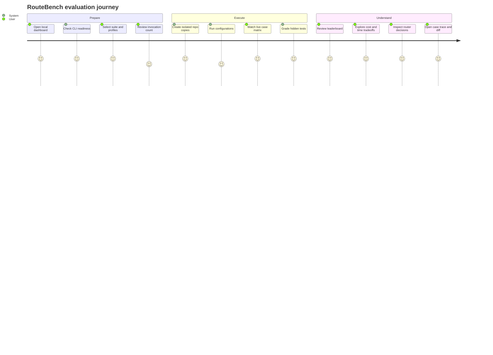

# Product Requirements Document — RouteBench

## 1. Product summary

RouteBench is a local evaluation platform for running the same coding tasks through multiple AI coding-agent configurations and comparing their correctness, reliability, speed, cost, behavior, and repository changes.

The first version compares Pi AutoRouter with fixed Claude Code and Codex configurations using the CLIs and authentication already installed on the user's laptop.

## 2. Problem

Developers can choose between routers, models, and coding CLIs, but informal comparisons are unreliable:

- Different agents receive different tasks or repository states.
- Success is judged by impression instead of hidden tests.
- Fast but incorrect results may look better than slower correct results.
- Cost, token usage, errors, and timeouts are often ignored.
- Router decisions are not connected to downstream outcomes.
- Useful evidence is spread across terminal output, diffs, test logs, and provider dashboards.

The user needs one repeatable workflow that can answer which complete configuration works best for their actual coding tasks.

## 3. Product vision

> Select an eval suite and agent configurations, start one run, and receive an evidence-backed comparison with every score traceable to tests, constraints, timing, usage, and code changes.

## 4. Goals

### 4.1 MVP goals

1. Run identical Python repository tasks against Pi, Claude Code, and Codex profiles.
2. Reuse existing CLI authentication without collecting API keys.
3. Keep every attempt independent through a fresh temporary repository copy.
4. Grade results with hidden deterministic tests and constraints.
5. Normalize structured CLI events into a common result format.
6. Track correctness, full pass rate, reliability, duration, tokens, cost, tool activity, and patch size.
7. Capture Pi AutoRouter provider/model selections when exposed in JSON output.
8. Present live progress and final comparisons through an understandable, visually strong local UI.
9. Preserve enough evidence to investigate why an attempt passed or failed.
10. Export run results as JSON and CSV.

### 4.2 Longer-term goals

- Add more languages and imported benchmark formats.
- Compare router decisions within a common harness.
- Add container or OS-level isolation.
- Run repeated trials across local or remote workers.
- Track performance across benchmark versions and agent updates.
- Add optional human or LLM rubric scores without replacing deterministic evidence.

## 5. Non-goals for v1

- Pure model API benchmarking
- Training or fine-tuning a router
- Jev or Laya integration
- Cloud execution or multi-user collaboration
- Docker orchestration
- Public leaderboard hosting
- Automatic installation or login for CLIs
- Reading or managing credential files
- Arbitrary untrusted repository execution
- LLM-as-a-judge scoring
- Statistical claims from a single run
- Automatic model pricing assumptions

## 6. Target user

### Primary persona: AI tool builder

A developer who:

- Uses Pi, Claude Code, and Codex locally.
- Maintains an AutoRouter or custom model aliases.
- Wants to know which setup produces the best practical coding results.
- Values reproducibility and inspectable evidence over marketing benchmarks.
- Needs a visual project that can be demonstrated during a build-in-public challenge.

### Secondary persona: agent-infrastructure engineer

A developer comparing tool policies, router strategies, prompts, or CLI versions across a controlled set of repository tasks.

## 7. Core user stories

1. As a user, I can see whether each configured CLI is installed before starting a run.
2. As a user, I can select the smoke or core suite and choose profiles to compare.
3. As a user, I can see the number of agent executions before confirming a run.
4. As a user, I can execute all selected configurations against identical cases.
5. As a user, I can follow live progress without reading multiple terminals.
6. As a user, I can rank configurations by correctness, reliability, time, or cost.
7. As a user, I can inspect the exact tests, diff, output, events, and failure for one attempt.
8. As a user, I can see which provider/model AutoRouter selected for each case.
9. As a user, I can distinguish reported cost, estimated cost, and unavailable cost.
10. As a user, I can export results for later analysis or publication.

## 8. Product principles

### 8.1 Evidence before interpretation

Every result must link back to deterministic graders, normalized events, timing, and repository changes.

### 8.2 Correctness remains independent

Cost and speed must not inflate or reduce the task correctness score.

### 8.3 Configuration-level honesty

The product must describe results as comparisons between complete agent configurations unless every harness variable is controlled.

### 8.4 Missing data stays missing

Unavailable cost, route, or token data is displayed as unavailable. RouteBench must not silently fabricate values.

### 8.5 Local first

Data, traces, fixture repositories, and results remain on the user's machine in v1.

### 8.6 Simple before autonomous

The prototype should favor explicit profiles, commands, suites, and graders over automatic discovery that is difficult to verify.

## 9. Primary workflow

## 10. Functional requirements

### FR-1 — Profile configuration

The system must support named profiles containing:

- Display name
- Adapter type
- Model or router alias
- Command override
- Timeout
- Tool or permission policy
- Allowed inherited environment variables
- Optional token prices
- Enabled/disabled state

Acceptance:

- Private aliases such as Sol, Terra, and Fable can be configured without source changes.
- Commands are represented as argument arrays or safe templates, not concatenated shell strings.

### FR-2 — Preflight

Before execution, the system must report:

- CLI executable availability
- CLI version when obtainable
- Whether non-interactive structured output is supported
- Whether the selected suite and fixtures are valid
- Number of cases, profiles, attempts, and total invocations
- Missing optional pricing information

The system must not inspect credential files.

### FR-3 — Suite selection

The user can choose:

- Smoke suite: three cases
- Core suite: all eight cases
- One or three attempts per configuration/case
- Timeout
- Sequential or optional parallel execution

Parallel execution must warn that laptop contention makes latency less comparable.

### FR-4 — Workspace preparation

For every attempt, the system must:

1. Copy the immutable fixture into a unique workspace.
2. Initialize or reset a local Git baseline.
3. Keep hidden graders outside the agent-visible copy.
4. Record fixture and suite versions.
5. Ensure paths remain beneath the configured workspace root.

### FR-5 — Agent execution

The system must invoke the selected CLI non-interactively and:

- Set the workspace as the current directory.
- Pass one canonical prompt.
- Use a fixed timeout.
- Continuously consume stdout and stderr to prevent deadlocks.
- Persist structured events incrementally.
- Record exit status, timeout, and adapter errors.
- Avoid persistent agent sessions for benchmark attempts.

### FR-6 — Deterministic grading

After agent execution, the system must:

- Run hidden functional tests.
- Run regression tests.
- Evaluate deterministic constraints.
- Record each grader independently.
- Calculate a transparent task score.
- Mark a full pass only when all mandatory checks pass.

### FR-7 — Metrics collection

Each attempt must store, when available:

- Functional, regression, and constraint scores
- Full-pass status
- Agent wall-clock duration
- Setup and grading duration
- Input, output, cached, and reasoning token counts
- Reported or estimated cost and provenance
- Tool calls, turns, retries, and errors
- Selected provider/model and response model
- Files changed, lines added, and lines removed
- Git diff and test output

### FR-8 — Live progress

The UI must display one cell per case/profile combination with states:

- Queued
- Preparing
- Running
- Grading
- Passed
- Failed
- Timed out
- Adapter error
- Cancelled

### FR-9 — Results comparison

The system must provide:

- Quality-first leaderboard
- Sort and filter controls
- Case-by-profile heatmap
- Category score comparison
- Quality-versus-time chart
- Quality-versus-cost chart when cost is available
- Pareto frontier highlighting non-dominated configurations
- Reliability and failure breakdown

### FR-10 — Router analysis

When route metadata is available, the system must show:

- Selected provider/model per attempt and turn
- Selection frequency
- Success and score by selected route
- Cost and duration by selected route
- Route changes within one attempt
- Potential under-routing and over-routing observations

The UI must label cross-harness route comparisons as observational rather than causal.

### FR-11 — Attempt detail

Selecting one result must reveal:

- Prompt and case metadata
- Profile and runtime metadata
- Score breakdown
- Test and grader output
- Final agent response
- Normalized event timeline
- Repository diff and patch statistics
- Tokens, cost, duration, and route
- Error details when applicable

### FR-12 — History and export

The user can:

- Reopen recent local runs.
- Compare runs with the same suite version.
- Export run summary and attempt data as JSON.
- Export leaderboard and case matrix as CSV.

## 11. Scoring requirements

Default task score:

| Component | Weight |
| --- | ---: |
| Hidden functional tests | 80% |
| Regression tests | 10% |
| Deterministic constraints and quality checks | 10% |

Requirements:

- Every case can override component weights when justified.
- Required checks can force full-pass failure regardless of partial score.
- Overall configuration score is the macro-average of task scores.
- Every task has equal weight unless the suite version explicitly says otherwise.
- Cost and time never enter task correctness.

## 12. UX requirements

- The dashboard should feel like an AI evaluation lab, not a generic admin panel.
- A first-time user should understand the workflow without reading documentation.
- The start screen must expose run size and readiness before execution.
- Live animation must clarify state changes without slowing interaction.
- Result colors must never be the only indicator of status.
- Detailed traces must be available without overwhelming the overview.
- Empty, missing-data, and partial-run states must be explicitly designed.

See [UI_UX_SPEC.md](UI_UX_SPEC.md).

## 13. Success criteria

The MVP succeeds when the user can:

1. Configure all six intended CLI profiles.
2. Validate them with the smoke suite.
3. Run the eight-case core suite without manually opening six terminals.
4. Receive deterministic scores for every completed attempt.
5. See route metadata for Pi when its JSON events expose it.
6. Identify best quality, fastest successful, cheapest successful, and most reliable configurations.
7. Open any result and understand why it passed or failed.
8. Export a complete run without exposing credentials.

## 14. Product acceptance criteria

- Identical fixture hashes and prompts are recorded across configurations.
- Hidden tests cannot be read from the agent workspace.
- A CLI crash affects one attempt, not the whole run.
- A timed-out process and its children are terminated.
- Missing cost is displayed as unavailable.
- Route analytics disappear gracefully when route metadata is absent.
- Sequential mode measures agent time separately from preparation and grading.
- Every leaderboard value is derivable from stored attempt data.
- The UI never labels the comparison as a pure model benchmark.
- No credential contents appear in the database, logs, exports, or UI.

## 15. Risks

| Risk | Impact | Mitigation |
| --- | --- | --- |
| Different CLI harnesses confound model quality | Misleading interpretation | Label results as configuration comparisons and provide runtime metadata. |
| Private aliases omit pricing | Incomplete cost view | Optional manual price table; otherwise display unavailable. |
| Router metadata differs from standard Pi messages | Missing router charts | Validate through preflight and support extension-specific parsing later. |
| Laptop load distorts latency | Unfair speed ranking | Sequential randomized execution and setup/grading time separation. |
| Agent edits tests to pass | Invalid correctness | Hidden tests outside the workspace and forbidden-path checks. |
| Process escapes temporary workspace | Host risk | Trusted fixtures only in v1; document that copies are not a security sandbox. |
| Small suite overstates conclusions | Weak generalization | Show case count and avoid statistical claims; add repeats and cases later. |

## 16. Release boundary

V1 is ready when the smoke and core suites, all three CLI adapters, deterministic grading, local result persistence, live UI, comparison views, case inspection, router metadata parsing, and export workflow work end to end on the user's machine.

