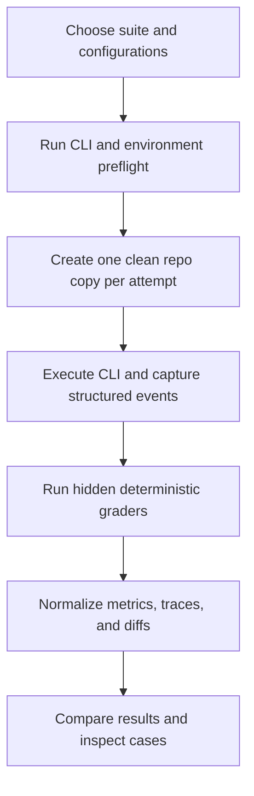

# RouteBench Documentation

**Status:** Local MVP implemented; see [validation results and access limits](VALIDATION_REPORT.md)  
**Version:** 1.0  
**Date:** 2026-09-23

RouteBench is a local evaluation workbench for comparing complete coding-agent configurations on identical repository tasks. Its first benchmark compares Pi AutoRouter with fixed configurations in Claude Code and Codex using the user's existing CLI installations and authentication.

RouteBench answers practical questions:

- Which configuration solves the most tasks correctly?
- Which successful configuration is fastest or cheapest?
- How reliable is each configuration across different task types?
- Which model does AutoRouter select, and how well do those routes perform?
- What did an agent change, run, and report on an individual case?

## Locked MVP scope

- Compare complete CLI configurations, not isolated model APIs.
- Use existing Pi, Claude Code, and Codex CLIs.
- Reuse their existing local authentication without reading credentials.
- Begin with custom Python-only coding tasks.
- Provide a three-case smoke suite and an eight-case core suite.
- Execute every case in a fresh temporary repository copy.
- Grade with hidden deterministic tests and constraints.
- Store results locally and present them in an interactive web UI.
- Do not use Jev, Laya, an LLM judge, Docker, or cloud infrastructure in v1.

## Initial configurations

The table below records the original design. The expanded current model list and verified IDs are in the [setup guide](../README.md#configure); rejected aliases are no longer selectable.

| ID | Configuration | Purpose |
| --- | --- | --- |
| `pi-autorouter` | Pi + AutoRouter | Dynamic routing candidate |
| `claude-opus` | Claude Code + Opus | Fixed Claude Code baseline |
| `claude-sonnet` | Claude Code + Sonnet | Fixed Claude Code baseline |
| `claude-fable` | Claude Code + Fable | Fixed Claude Code baseline |
| `codex-sol` | Codex + Sol | Fixed Codex baseline |
| `codex-terra` | Codex + Terra | Fixed Codex baseline |

These are **agent configurations**. Differences may come from the model, CLI system prompt, tool implementation, permissions, context handling, or retry behavior. RouteBench must not present the results as a pure model benchmark.

## Documentation map

| Document | Purpose |
| --- | --- |
| [working.md](working.md) | Tasks in Smoke and Core, user workflow, execution lifecycle, scoring, and reruns |
| [PRD.md](PRD.md) | Product goals, users, requirements, scope, and acceptance criteria |
| [TRD.md](TRD.md) | Architecture, components, execution model, and technical requirements |
| [UI_UX_SPEC.md](UI_UX_SPEC.md) | Screens, interactions, visual language, animations, and result presentation |
| [EVALUATION_METHODOLOGY.md](EVALUATION_METHODOLOGY.md) | Fairness protocol, metric definitions, scoring, ranking, and interpretation |
| [EVAL_SET_SPEC.md](EVAL_SET_SPEC.md) | Python eval-set structure, eight initial cases, hidden graders, and validation |
| [CLI_ADAPTER_SPEC.md](CLI_ADAPTER_SPEC.md) | Pi, Claude Code, Codex invocation and normalized event contracts |
| [DATA_AND_API_SPEC.md](DATA_AND_API_SPEC.md) | Local data model, normalized result schema, API, events, and exports |
| [SECURITY_AND_ISOLATION.md](SECURITY_AND_ISOLATION.md) | Threat model, credential handling, process boundaries, and prototype limitations |
| [IMPLEMENTATION_PLAN.md](IMPLEMENTATION_PLAN.md) | Recommended build order, tests, milestones, and definition of done |
| [DECISIONS_AND_OPEN_QUESTIONS.md](DECISIONS_AND_OPEN_QUESTIONS.md) | Locked decisions, assumptions, validation spikes, and deferred questions |
| [RESEARCH_NOTES.md](RESEARCH_NOTES.md) | Official CLI capabilities and sources used to inform the design |
| [VALIDATION_REPORT.md](VALIDATION_REPORT.md) | Implementation checks, actual CLI outcomes, and remaining validation limits |

## Product workflow

## Result philosophy

RouteBench does not reduce every tradeoff to one opaque score. Correctness remains independent from cost and speed. The UI highlights several useful winners instead:

- Best quality
- Most reliable
- Fastest successful
- Cheapest successful
- Best quality per minute
- Best quality per dollar, when cost is available

## Key vocabulary

- **Configuration:** A CLI, model or router setting, tool policy, and relevant runtime settings considered as one tested system.
- **Suite:** A versioned collection of evaluation cases.
- **Case:** One repository fixture, task prompt, hidden graders, constraints, and metadata.
- **Attempt:** One configuration executing one case in a fresh workspace.
- **Full pass:** All mandatory correctness, regression, and constraint checks pass.
- **Task score:** Transparent weighted score for one attempt; cost and time do not affect it.
- **Reported cost:** Cost emitted by the CLI or provider.
- **Estimated cost:** Cost calculated from configured prices and reported tokens.
- **Observed route:** Provider/model recorded in Pi's completed assistant messages.

## Important limitation

A temporary repository copy protects benchmark state and makes runs repeatable, but it is not a security sandbox. V1 is intended for trusted, locally authored eval repositories. Strong isolation is a later Docker or OS-sandbox feature.
