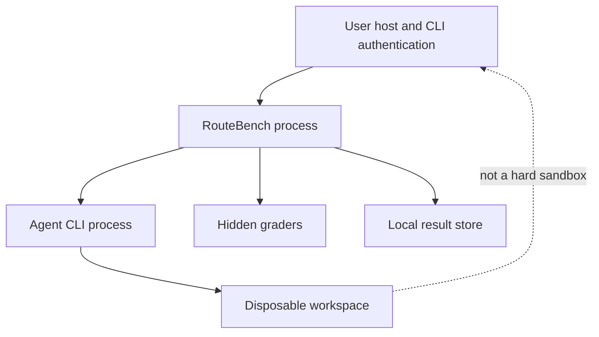

# Security and Isolation

## 1. Security posture

RouteBench v1 is a local evaluation tool for trusted, locally authored repository fixtures. It is not a secure sandbox for arbitrary third-party repositories.

A disposable repository copy provides reproducibility and protects the canonical fixture, but it does not prevent an agent or test process from accessing other host resources allowed to the current user.

## 2. Protected assets

- CLI authentication state
- API keys and bearer tokens
- SSH keys and agents
- Browser and OS credential stores
- User files outside RouteBench workspaces
- Hidden tests and reference solutions
- Private prompts and output traces
- Local model pricing and configuration

## 3. Threats considered

| Threat | Example |
| --- | --- |
| Credential disclosure | A fixture command prints environment variables or reads an auth file. |
| Host filesystem access | An agent shell command traverses outside its workspace. |
| Network exfiltration | Repository code sends local data to an external endpoint. |
| Prompt injection | Fixture instructions attempt to override benchmark policy. |
| Hidden-test leakage | The agent finds or edits hidden graders. |
| Command injection | A prompt or model alias is concatenated into a shell command. |
| Log leakage | CLI stderr contains tokens, private URLs, or headers. |
| Process leakage | A timed-out agent leaves child processes running. |
| Unsafe deletion | Cleanup targets an unresolved or broad path. |

## 4. Trust boundary



The dotted relationship is the central v1 limitation: an agent process can potentially reach host resources available to its OS user.

## 5. Credential handling requirements

RouteBench must never:

- Open or copy Codex, Claude Code, or Pi credential files.
- Print API keys or bearer tokens.
- Invoke Pi credential-printing commands.
- Store credentials in YAML profiles.
- Send credentials through the web UI.
- Include credentials in process arguments.
- Export environment values.

Authentication is delegated to each already-configured CLI.

Safe readiness checks may report only states such as ready, not ready, or not checked.

## 6. Environment policy

- Remove obvious secret-bearing environment variables by default.
- Preserve normal execution variables such as `PATH`, `HOME`, locale, and temporary paths.
- Allow sensitive variables only through an explicit per-profile allowlist.
- Show a warning before running a profile that inherits sensitive variables.
- Never log profile environment values.

Important: if an API key must be inherited, code executed by the agent may be able to read it. The safer v1 path is saved CLI login state, but saved credentials may still be accessible to a process running as the same user.

## 7. Command execution requirements

- Use subprocess argument arrays.
- Do not use `shell=True`.
- Do not evaluate prompt, path, or model strings as shell syntax.
- Resolve the executable through the OS path.
- Validate command placeholders against an allowlist.
- Set the working directory explicitly to the attempt workspace.
- Assign every agent to a process group.
- Terminate the complete process group on timeout or cancellation.

Grader commands are suite-authored argument arrays and run with a scrubbed environment.

## 8. Filesystem protections

- Workspace root must be an explicit, narrow path.
- Every attempt path is resolved and verified beneath that root.
- Reject fixture symlinks in v1.
- Never use unresolved environment variables or globs for cleanup targets.
- Do not recursively delete a workspace unless its resolved path is a descendant of the configured root and contains an expected attempt marker.
- Keep hidden tests and reference solutions outside agent-visible directories.
- Make canonical fixtures read-only where practical.
- Store artifacts with user-only filesystem permissions.

## 9. Hidden-test protection

1. Agent workspace contains only public fixture content.
2. Hidden tests are introduced after the agent exits.
3. The grading overlay path is never included in the prompt or agent environment.
4. Test-source content is not returned in normal exports.
5. Grader output is sanitized so it does not unnecessarily reveal hidden assertions.
6. Generated hidden-test files are removed immediately after grading.

## 10. Network policy

The CLI requires network access to contact its model provider. V1 cannot guarantee that shell commands spawned by every CLI are separately network-restricted.

Therefore:

- Cases must not require arbitrary external network access.
- Fixture setup must use already-installed or locally cached dependencies.
- Network behavior is recorded as a run policy label.
- Untrusted repositories are prohibited.
- Strong outbound isolation is deferred to a container or OS-sandbox release.

## 11. Pi-specific limitation

Pi's built-in tools run with process permissions. RouteBench's temporary copy prevents benchmark-state contamination but does not confine Pi to that directory.

The UI and documentation must surface this limitation before the first real Pi run.

## 12. Log and event redaction

Before persistence or display, scan strings for high-confidence patterns including:

- Common API-key prefixes
- Authorization and bearer headers
- Private-key blocks
- JWT-like values
- Sensitive URL query parameters
- Explicitly configured secret values

Redaction format:

```text
[REDACTED: possible token]
```

Redaction should occur on a copy of the stream before normal storage. If secure local debugging requires raw logs later, that must be a separate explicit mode with stronger warnings and restricted permissions.

## 13. Web UI security

- Bind to `127.0.0.1` by default.
- Do not expose a public interface without explicit configuration.
- Escape all prompt, output, diff, and event content.
- Use a strict Content Security Policy.
- Do not render agent-generated HTML.
- Apply request-size limits.
- Protect mutating endpoints against cross-origin requests.
- Do not place secrets in browser storage.
- Validate artifact IDs and paths server-side.

## 14. Data privacy

- All data remains local in v1.
- Exports exclude credentials, complete environments, hidden-test source, and absolute home-directory paths.
- Replace absolute workspace paths with run-relative paths in the UI and exports.
- The user controls artifact retention and deletion.

## 15. Security preflight

Block or warn before a run when:

- The server is configured to bind beyond localhost.
- A fixture contains a symlink.
- A profile inherits a sensitive environment variable.
- A command requests danger-full host permissions.
- A suite fixture is outside approved roots.
- An artifact/workspace path resolves outside its configured root.
- Hidden grader files appear inside the public fixture.

## 16. Incident behavior

If a likely secret appears:

1. Stop scheduling new attempts.
2. Terminate active processes when safe.
3. Redact the value from UI-visible state.
4. Mark the run blocked by security review.
5. Tell the user which artifact and attempt triggered the detector without repeating the value.
6. Do not export or automatically continue the run.

## 17. Deferred hardening

- Docker or rootless container per attempt
- Read-only host mounts
- Explicit CPU, memory, disk, and process limits
- Network namespace with provider-only egress proxy
- Seccomp/AppArmor profiles
- Separate OS user for agents
- Signed suite manifests
- Encrypted artifact storage
- Remote worker authentication

