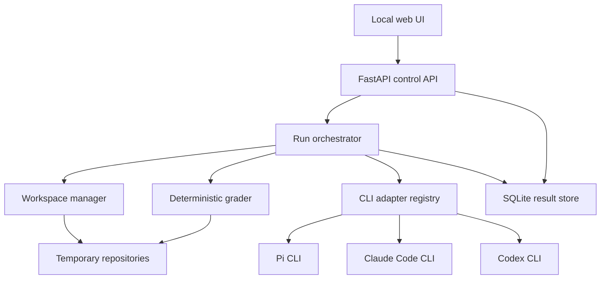
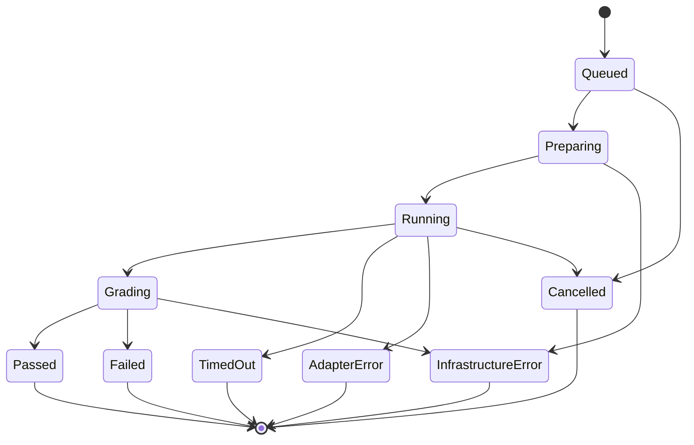
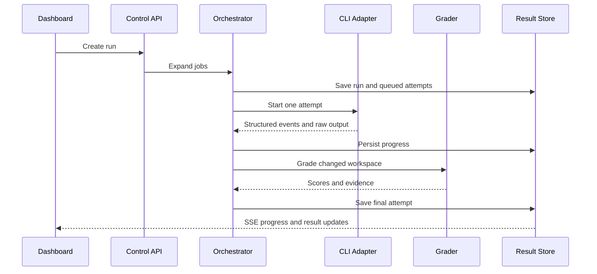

# Technical Requirements Document — RouteBench

## 1. Technical objective

Build a local-first system that orchestrates existing coding-agent CLIs against versioned Python repository fixtures, grades their changes deterministically, normalizes heterogeneous event streams, and serves an interactive comparison dashboard.

The first implementation should remain small enough to understand and debug while preserving clear boundaries around CLI adapters, workspace preparation, grading, storage, and presentation.

## 2. Recommended stack

| Layer | Technology | Reason |
| --- | --- | --- |
| Runtime | Python 3.11+ | Native subprocess, filesystem, testing, and data-processing support |
| API | FastAPI | Typed local API and streaming support with little boilerplate |
| Validation | Pydantic | Explicit config and result schemas |
| Persistence | SQLite | Durable local storage without infrastructure |
| Configuration | YAML | Human-editable suites and profiles |
| Frontend | React + TypeScript + Vite | Clear component model for live state, charts, matrix, and drawers |
| Styling | CSS variables plus lightweight utility classes | Catchy visual design without a large design-system dependency |
| Charts | Recharts or equivalent lightweight local dependency | Scatter plots, bar charts, and Pareto visualization |
| Testing | Pytest + frontend component tests + Playwright smoke test | Unit, integration, and UI coverage |

No additional backend service, queue, container platform, or model SDK is required in v1.

## 3. System architecture



## 4. Major components

### 4.1 Configuration loader

Responsibilities:

- Parse and validate `routebench.yaml`.
- Resolve relative paths from the config location.
- Load profile definitions.
- Load versioned suite manifests.
- Reject duplicate IDs and invalid command templates.
- Produce a redacted, stable configuration fingerprint.

It must never serialize profile secrets into logs or run snapshots.

### 4.2 Profile registry

Each profile defines one complete tested configuration:

```yaml
profiles:
  pi-autorouter:
    label: Pi AutoRouter
    adapter: pi
    model: autorouter
    timeout_seconds: 900

  claude-sonnet:
    label: Claude Code · Sonnet
    adapter: claude
    model: sonnet
    timeout_seconds: 900

  codex-sol:
    label: Codex · Sol
    adapter: codex
    model: sol
    timeout_seconds: 900
```

Optional fields include command overrides, environment allowlists, prices, permission mode, and enabled state.

### 4.3 Suite registry

The suite registry loads immutable case specifications and exposes:

- Suite metadata and version
- Case metadata
- Fixture location and content hash
- Canonical prompt and hash
- Hidden-grader location
- Grader weights and mandatory flags
- Default timeout and tags

Suite validation occurs before a run is accepted.

### 4.4 Preflight service

Checks:

- CLI path resolution
- CLI version
- Structured output capability
- Git and Python availability
- Suite validity
- Fixture and hidden-grader separation
- Writable workspace and database directories
- Optional cost configuration

Preflight may run benign version/help commands. It must not print or retrieve authentication tokens.

### 4.5 Run orchestrator

Responsibilities:

- Expand a run into case/profile/attempt jobs.
- Seed and store randomized execution order.
- Enforce sequential execution by default.
- Publish lifecycle events to the UI.
- Isolate one job failure from the rest of the run.
- Support safe cancellation.
- Finalize run aggregates after all jobs reach a terminal state.

The prototype can use an in-process asynchronous scheduler. A separate worker service is unnecessary.

### 4.6 Workspace manager

For each attempt:

1. Validate that the fixture contains no escaping symlinks.
2. Copy it to a unique directory.
3. Initialize a Git repository and create a baseline commit.
4. Record the baseline tree hash.
5. Expose only fixture files to the agent.
6. Capture post-run status, diff, and patch statistics.
7. Retain or delete the workspace according to policy.

Example layout:

```text
.routebench/
├── routebench.db
├── artifacts/
│   └── <run-id>/
│       └── <attempt-id>/
│           ├── events.jsonl
│           ├── stdout.log
│           ├── stderr.log
│           ├── graders.json
│           └── patch.diff
└── workspaces/
    └── <run-id>/
        └── <case-id>/
            └── <profile-id>-<attempt-index>/
```

### 4.7 CLI adapters

Every adapter implements a common interface:

```python
class AgentAdapter(Protocol):
    def preflight(self, profile: Profile) -> PreflightResult: ...
    def build_command(self, context: AttemptContext) -> list[str]: ...
    async def parse_event(self, line: str) -> list[NormalizedEvent]: ...
    def finalize(self, process: ProcessResult) -> AgentResult: ...
```

See [CLI_ADAPTER_SPEC.md](CLI_ADAPTER_SPEC.md).

### 4.8 Process supervisor

Requirements:

- Use argument arrays with `create_subprocess_exec`; never use interpolated shell commands.
- Stream stdout and stderr concurrently.
- Write raw output to bounded artifact files.
- Parse JSONL incrementally.
- Track process-group identity.
- On timeout or cancellation, terminate the process group, wait briefly, then force-kill remaining children.
- Record launch time, first-event time, exit time, code, signal, and timeout state.

### 4.9 Grader engine

The grader runs only after the agent process exits.

Supported v1 graders:

- Command exit status
- Pytest/JUnit result parser
- File exists or absent
- File contains or excludes text/regex
- Allowed-path constraint
- Forbidden-path constraint
- Diff size threshold
- Ruff/lint command
- Type-check command

Hidden tests must be copied or made available only during grading, outside the agent-visible workspace during execution.

### 4.10 Metric normalizer

Converts adapter-specific data to canonical fields:

- Usage tokens
- Cost and provenance
- Provider/model route
- Message and tool counts
- Retries
- Final response
- Errors

It must retain raw events so parser corrections can be applied later without rerunning expensive attempts.

### 4.11 Result store

SQLite stores queryable summaries. Large artifacts remain on disk and are referenced by relative paths plus content hashes.

The database must use migrations from the beginning, even if the first migration is small.

### 4.12 API and event stream

FastAPI exposes run creation, state, attempt details, history, cancellation, and exports. Server-Sent Events provide live updates because communication is server-to-browser and unidirectional.

See [DATA_AND_API_SPEC.md](DATA_AND_API_SPEC.md).

### 4.13 Frontend

The frontend provides:

- New-run configuration
- Preflight status
- Live execution matrix
- Result summary and charts
- Router analysis
- Attempt inspector
- History and exports

It should never derive authoritative metrics independently. Aggregated API values remain canonical.

## 5. Attempt lifecycle



Infrastructure errors are not silently scored as model failures. They are visible and eligible for rerun.

## 6. Execution sequence



## 7. Canonical prompt policy

Each case stores one user-facing prompt. RouteBench may append only a short, versioned benchmark suffix that is identical across profiles, such as:

- Work only in the current repository.
- Implement the requested change.
- Run relevant tests if possible.
- Do not ask for interactive input.

Tool-specific permission text belongs in the adapter configuration, not the task prompt.

## 8. Hidden grader strategy

Recommended flow:

1. The agent receives the public fixture and visible tests.
2. After it exits, RouteBench snapshots the diff.
3. Hidden tests are copied from the suite's private grader directory into a temporary grading overlay.
4. Graders run with a scrubbed environment.
5. The hidden files and generated caches are removed before final patch capture or explicitly excluded.

This prevents the agent from reading or editing hidden tests while allowing ordinary Python tooling during grading.

## 9. Concurrency and resource behavior

- Default maximum active agent processes: `1`.
- Optional fast mode: configurable concurrency, default maximum `2`.
- Graders may run concurrently only if they do not compete with active timing-sensitive agent jobs.
- The UI must label runs as `sequential` or `parallel`.
- Concurrency settings form part of run metadata.

## 10. Configuration file

Illustrative structure:

```yaml
version: 1

server:
  host: 127.0.0.1
  port: 8765

storage:
  database: .routebench/routebench.db
  artifacts: .routebench/artifacts
  workspaces: .routebench/workspaces
  keep_workspaces: false

execution:
  mode: sequential
  timeout_seconds: 900
  attempts: 1
  random_seed: 42

suites:
  python-smoke: evals/python-core/suite.yaml#smoke
  python-core: evals/python-core/suite.yaml

profiles:
  pi-autorouter:
    label: Pi AutoRouter
    adapter: pi
    model: autorouter

  claude-opus:
    label: Claude Code · Opus
    adapter: claude
    model: opus

  codex-terra:
    label: Codex · Terra
    adapter: codex
    model: terra
    pricing:
      source: manual
      effective_date: 2026-09-23
      input_per_million: null
      output_per_million: null
```

## 11. Error handling

| Failure | Required behavior |
| --- | --- |
| CLI missing | Fail preflight for that profile; do not start it. |
| Authentication failure | Mark adapter error with sanitized message; never request credentials through the UI. |
| Invalid JSON line | Preserve raw line, increment parser-warning count, continue if possible. |
| Process timeout | Terminate process group, mark timed out, then apply case timeout policy. |
| Grader infrastructure failure | Mark infrastructure error; do not score as an agent failure. |
| One attempt crashes | Continue remaining attempts. |
| Database write failure | Stop scheduling new attempts and surface a run-level error. |
| Browser disconnect | Continue run; reconnect from persisted state and event cursor. |

## 12. Project structure

```text
routebench/
├── README.md
├── pyproject.toml
├── routebench.example.yaml
├── backend/
│   └── routebench/
│       ├── api/
│       ├── adapters/
│       ├── evals/
│       ├── execution/
│       ├── grading/
│       ├── metrics/
│       ├── storage/
│       └── main.py
├── frontend/
│   ├── src/
│   │   ├── components/
│   │   ├── pages/
│   │   ├── charts/
│   │   └── api/
│   └── package.json
├── evals/
│   └── python-core/
│       ├── suite.yaml
│       ├── fixtures/
│       ├── hidden-graders/
│       └── reference-solutions/
├── tests/
└── docs/
```

Small modules should be combined when separation adds no clarity.

## 13. Testing strategy

### Unit tests

- Config and suite validation
- Command construction
- JSONL parsers using recorded fixtures
- Event normalization
- Metric and score calculations
- Pareto frontier calculation
- Safe path resolution
- Environment redaction

### Integration tests

- Mock adapter end-to-end run
- Workspace copy, Git baseline, diff, and cleanup
- Hidden grader injection and removal
- SQLite persistence and migration
- SSE reconnect and event replay
- Timeout and child-process termination

### Contract tests

Store sanitized sample outputs for supported Pi, Claude Code, and Codex versions. Parsers must pass these fixtures without invoking paid models.

### UI tests

- New-run validation
- Live matrix updates
- Missing cost/route states
- Leaderboard sorting
- Case drawer evidence
- Responsive layout
- Keyboard access and reduced-motion behavior

### Local smoke test

Run one harmless real task per installed CLI after explicit user initiation. This validates current flags and output shape but is not part of automated tests.

## 14. Performance requirements

- Dashboard API responses under 300 ms for typical local runs.
- Live-event UI update within one second of persistence.
- Incremental event storage to prevent unbounded in-memory traces.
- Attempt-detail artifacts loaded on demand.
- Initial target: up to 500 attempts and 100,000 normalized events in one local database.

## 15. Technical definition of done

- All six profiles can be represented without code changes.
- Smoke and core suites validate before execution.
- One adapter failure does not terminate the run.
- Raw and normalized events remain available.
- Scores exactly match grader outputs.
- Route metadata is captured when present.
- Missing data is represented explicitly.
- The dashboard can be restored from persisted state after restart.
- Security requirements in [SECURITY_AND_ISOLATION.md](SECURITY_AND_ISOLATION.md) are enforced or clearly surfaced as limitations.

