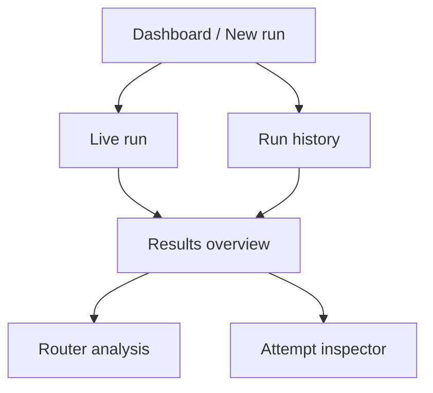
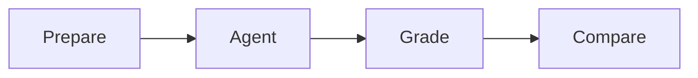

# UI/UX Specification

## 1. Experience goal

RouteBench should feel like a focused AI evaluation lab: technically credible, visually distinctive, and immediately understandable.

The visual experience should communicate three things:

1. Multiple agents are receiving the same challenge.
2. Their work is being measured rather than merely observed.
3. Every conclusion can be opened and inspected.

## 2. Design principles

### Data first

The strongest visual element is the comparison itself: matrix, leaderboard, charts, and evidence.

### Progressive disclosure

The overview shows outcomes. Details such as raw events, grader output, and full diffs open on demand.

### Motion explains state

Animation is used to show preparation, execution, grading, and completion—not as decoration.

### Honest uncertainty

Missing cost, missing route data, partial runs, and cross-harness limitations are visible.

### Fast local control

Starting a run, opening a failed case, and changing sort criteria should feel immediate.

## 3. Visual direction

### Theme

Dark technical workspace with restrained high-saturation accents. Avoid a generic black-and-neon “AI dashboard” by using warm surfaces, careful typography, and strong data hierarchy.

### Suggested tokens

| Token | Value | Use |
| --- | --- | --- |
| Background | `#08090D` | App background |
| Surface | `#12141C` | Main panels |
| Raised surface | `#191C26` | Interactive cards and drawers |
| Border | `rgba(255,255,255,.09)` | Dividers and panel outlines |
| Text | `#F5F7FB` | Primary text |
| Muted | `#969BAA` | Secondary text |
| Success | `#20E3B2` | Passing states and quality highlight |
| Violet | `#8D73FF` | Router and selection accent |
| Amber | `#FFB454` | Running, warning, and cost accent |
| Failure | `#FF6B76` | Failure and timeout |
| Info | `#65A6FF` | Neutral information |

Typography:

- UI and headings: Manrope, Inter, or local system sans-serif
- Metrics and event metadata: a local monospace stack
- Use tabular numerals for score, time, tokens, and cost

### Profile colors

Assign each profile a persistent color that remains consistent across charts, matrix columns, and route diagrams. Status colors override profile colors only for explicit pass/fail states.

## 4. Information architecture

Use one application shell with top navigation:

- New Run
- History
- Settings
- Documentation link

## 5. Screen 1 — Dashboard and new run

### Purpose

Explain the product quickly and start a valid run with confidence.

### Layout

1. Compact product header and local-only status.
2. Intro statement: “Compare coding agents with evidence.”
3. Suite selector.
4. Profile selection grid.
5. Run settings.
6. Preflight summary.
7. Invocation summary and start button.
8. Recent runs.

### Profile card

Shows:

- Configuration name
- CLI and model/router alias
- Readiness indicator
- CLI version
- Cost-reporting capability
- Route-reporting capability
- Selected state

Unavailable cards remain visible but cannot be selected. Their reason is shown directly.

### Run summary

Before start, display:

- `8 cases × 6 profiles × 1 attempt = 48 executions`
- Sequential or parallel mode
- Timeout
- Profiles with missing pricing
- Security warning for profiles with weaker sandboxing

### Primary action

Button label: **Start 48 evaluations**

It is disabled until the suite validates and at least one ready profile is selected.

## 6. Screen 2 — Live run

### Primary visualization: case matrix

Rows are cases. Columns are profiles. Every cell contains:

- Status icon and label
- Elapsed agent time while running
- Final score when graded
- Route badge for Pi when available

Status design:

| Status | Visual treatment |
| --- | --- |
| Queued | Neutral outline and sequence number |
| Preparing | Gentle rotating border |
| Running | Profile color pulse and elapsed timer |
| Grading | Animated three-step test indicator |
| Passed | Green check and score |
| Failed | Red cross and score |
| Timed out | Amber clock plus timeout label |
| Adapter error | Red terminal icon plus short code |
| Infrastructure error | Hatched neutral/red state, clearly distinct from agent failure |

### Run progress rail

Show the full lifecycle:

The active phase moves smoothly, with a reduced-motion static alternative.

### Live side panel

Selecting a running cell opens a non-blocking panel showing:

- Current stage
- Last safe normalized event
- Tool name and summarized command
- Observed route
- Elapsed time

Do not stream hidden reasoning. Avoid presenting raw event noise by default.

## 7. Screen 3 — Results overview

### Header

- Suite name and version
- Run ID and date
- Configurations and attempts
- Sequential/parallel label
- Warnings
- Export action

### KPI row

- Highest quality
- Best full pass rate
- Fastest successful
- Cheapest successful or “cost incomplete”
- Most reliable

Each KPI identifies a profile and links to its leaderboard row.

### Leaderboard

Columns:

- Rank
- Profile
- Mean score
- Full passes
- Completion rate
- Median agent time
- Total/median cost
- Tokens
- Tool calls

Default sorting is quality-first. Provide presets:

- Quality
- Reliability
- Speed
- Cost
- Value

Cost and value presets are disabled when cost coverage is insufficient.

### Charts

1. Category score grouped bars
2. Case/profile score heatmap
3. Quality versus agent time scatter
4. Quality versus cost scatter
5. Failure-type breakdown

Scatter plots highlight the Pareto frontier with a connected line and descriptive tooltip.

Avoid radar charts in the MVP; they are less precise for close comparisons.

## 8. Screen 4 — Router analysis

Show this tab only when route data exists.

### Sections

1. Route distribution donut or stacked bar
2. Score and pass rate by selected route
3. Cost and agent time by route
4. Route by category heatmap
5. Per-case route timeline
6. Potential over-routing and under-routing observations

Every potential routing issue includes a tooltip:

> Observational comparison across different CLI harnesses; not proof that the route itself caused the result.

If Pi uses several models in one attempt, show a turn-by-turn timeline rather than collapsing silently to one model.

## 9. Screen 5 — Attempt inspector

Open as a right-side drawer on desktop and full-screen sheet on mobile.

### Summary strip

- Pass/fail state
- Score
- Agent time
- Cost provenance
- Tokens
- Selected route

### Tabs

1. **Evidence** — grader breakdown and test output
2. **Diff** — syntax-highlighted patch and patch statistics
3. **Timeline** — normalized messages, tools, retries, and route changes
4. **Output** — final response and sanitized stderr
5. **Metadata** — versions, hashes, command preview, timing boundaries

The Evidence tab is the default because it explains the score.

### Grader display

Every grader row includes:

- Component
- Weight
- Score
- Mandatory badge
- Pass/fail
- Short evidence summary

Infrastructure failures use a separate visual state and are never shown as a zero-score model failure.

## 10. Screen 6 — History

List or table with:

- Suite and version
- Date
- Profiles
- Attempt count
- Status
- Highest-quality profile
- Cost coverage
- Warnings

Filters:

- Suite
- Profile
- Status
- Date

Two runs can be compared only when case/suite compatibility is clear. If versions differ, display the mismatch before comparison.

## 11. Settings

The prototype settings screen covers:

- Redacted profile configuration status
- CLI preflight
- Default timeout and attempt count
- Sequential/parallel mode
- Artifact retention
- Optional prices
- Workspace and database locations

Do not put credentials or raw environment values in this screen.

## 12. Motion specification

### Allowed motion

- 180–260 ms panel and drawer transitions
- Smooth progress interpolation
- Subtle status pulse for active jobs
- Matrix-cell transition when an attempt changes stage
- Chart entry animation after a run completes
- Route line animation when an observed model appears

### Avoid

- Constant background motion
- Large layout shifts
- Counting animations that delay reading exact values
- Flashing status colors
- Motion on every polling update

Respect `prefers-reduced-motion`; replace movement with immediate state changes and static outlines.

## 13. Empty and exceptional states

| State | Message/action |
| --- | --- |
| No runs | Explain smoke suite and offer “Run the smoke suite.” |
| CLI missing | Show installation/readiness guidance without requesting credentials. |
| Cost unavailable | Display `—` with “No trustworthy price configured.” |
| Route unavailable | Hide router tab and explain that outcome comparison still works. |
| Partial run | Keep completed evidence; identify cancelled or invalid attempts. |
| Infrastructure failure | Offer rerun after repair; do not rank the attempt as agent failure. |
| No profile passes | Show diagnostic comparison without awarding fastest/cheapest successful. |

## 14. Accessibility

- WCAG AA contrast target
- Keyboard navigation across cards, tables, tabs, and drawer
- Visible focus rings
- Status text and icons in addition to color
- Table equivalents for every chart
- Screen-reader announcements for significant run progress, throttled to avoid noise
- Reduced motion support
- Monospace data remains selectable and zoom-safe

## 15. Responsive behavior

- Desktop: full matrix, persistent charts, right drawer
- Tablet: horizontally scrollable matrix, stacked charts
- Mobile: case cards instead of wide matrix, full-screen attempt sheet

The desktop experience is primary because this is a local developer tool, but the UI should remain reviewable on smaller screens.

## 16. Screenshot-worthy states

For the build-in-public demo, prioritize:

1. New-run screen showing all six configurations ready
2. Live matrix with mixed running, grading, and completed states
3. Final leaderboard plus quality/time Pareto chart
4. Router-analysis screen showing selected-model distribution

No screenshot should expose usernames, absolute home paths, private endpoints, credentials, or raw authentication errors.

