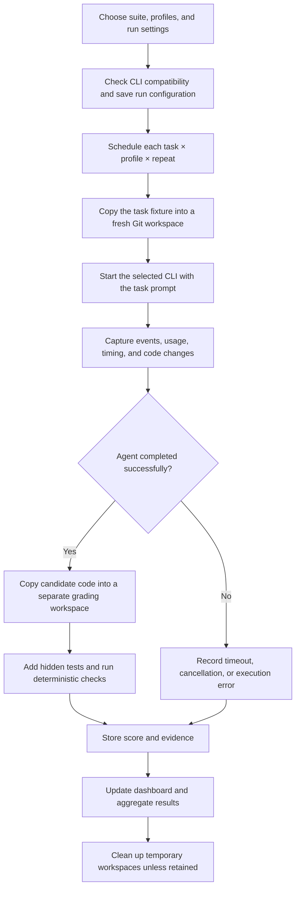

# How RouteBench works

RouteBench runs the same coding tasks through your selected Pi, Claude Code, and Codex profiles, grades the resulting code, and compares correctness, time, and available cost data. It measures the whole agent configuration: model, CLI, tools, permissions, and existing CLI customizations.

This guide describes the implemented application and the tasks in [the suite manifest](../evals/python-core/suite.yaml).

## The three eval sets

All sets use the same task definitions. **Smoke and Planning are subsets of Core**, selected by the `smoke` and `planning` tags. The definitions are not duplicated.

| Set | Configuration ID | Tasks | Purpose |
| --- | --- | --- | --- |
| Python Smoke | `python-smoke` | RB-PY-001, RB-PY-003, RB-PY-005 | A smaller check covering a bug fix, a feature, and a harder change across multiple files |
| Python Core | `python-core` | RB-PY-001 through RB-PY-009 | The complete nine-task evaluation |
| Python Planning | `python-planning` | RB-PY-009 | One planning, implementation, and verification task |

The YAML selects them with:

```yaml
suites:
  python-smoke: evals/python-core/suite.yaml#smoke
  python-core: evals/python-core/suite.yaml
  python-planning: evals/python-core/suite.yaml#planning
```

### Tasks

Every task supplies a small Python repository, a README with its requirements, and visible tests. The agent must preserve the documented public APIs and tests, change only the permitted source paths, and keep runtime dependencies in the Python standard library. The harness supplies pytest.

| ID and task | Included in | Type / difficulty | What the agent must implement |
| --- | --- | --- | --- |
| [RB-PY-001 — Decimal average correction](../evals/python-core/fixtures/RB-PY-001/README.md) | Smoke + Core | Bug fix / Easy | Fix invoice averages so fractional results are retained, Decimal input stays Decimal, generators work, and empty input returns `0`. Preserve summary behavior and avoid mutating inputs. Changes stay in `invoice/`. |
| [RB-PY-002 — Retry-After parser](../evals/python-core/fixtures/RB-PY-002/README.md) | Core | Bug fix / Medium | Parse integer seconds or HTTP dates using an injected clock. Handle time zones, clamp past dates to zero, return the supplied fallback for invalid values, and preserve case-insensitive header lookup and the maximum-delay cap. Changes stay in `http_retry/`. |
| [RB-PY-003 — Inventory filtering feature](../evals/python-core/fixtures/RB-PY-003/README.md) | Smoke + Core | Feature / Easy | Add filters for category, availability, and inclusive maximum price, combining enabled filters with AND. Handle missing values, `False`, and zero correctly; preserve item identity and order without mutating the catalog. Changes stay in `inventory/`. |
| [RB-PY-004 — TTL cache feature](../evals/python-core/fixtures/RB-PY-004/README.md) | Core | Feature / Medium | Add per-entry expiration using an injected clock. Expired entries disappear from reads, membership checks, and length. Handle immediate expiry, no expiry, replacement deadlines, and negative TTL without damaging an existing entry. Changes stay in `cache.py`. |
| [RB-PY-005 — Layered configuration resolution](../evals/python-core/fixtures/RB-PY-005/README.md) | Smoke + Core | Multiple files / Hard | Merge defaults, project settings, explicitly supplied environment values, and runtime overrides in that priority order. Merge nested leaves, skip `None`, centralize type conversion, validate every supplied value, and report useful errors without mutating inputs or defaults. Changes stay in `settings/`. |
| [RB-PY-006 — Event export across layers](../evals/python-core/fixtures/RB-PY-006/README.md) | Core | Multiple files / Medium | Add CSV serialization, a service export method, and `list --format csv` while keeping JSON as the default. Preserve filtering and order, emit headers even for empty data, and correctly quote commas, quotes, newlines, and Unicode with CRLF record endings. The CLI must export through the service. Changes stay in `events/`. |
| [RB-PY-007 — Transport registry refactor](../evals/python-core/fixtures/RB-PY-007/README.md) | Core | Refactor / Hard | Replace duplicated built-in transport selection with one shared registry used by creation, sending, and preview. Preserve behavior, imports, options, and exceptions; support custom factories and reject duplicate registrations. Structural checks require the old dispatch branches to be removed. Changes stay in `transports/`. |
| [RB-PY-008 — Safe path normalization](../evals/python-core/fixtures/RB-PY-008/README.md) | Core | Edge case / Easy | Resolve artifact paths strictly inside a root. Allow safe nested paths and dot segments, but reject escapes, absolute paths, Windows drive prefixes, backslashes, NUL bytes, and invalid inputs. Resolve existing symlinks and enforce containment without creating files. Changes stay in `artifacts/`. |
| [RB-PY-009 — Inventory reservations: plan, implement, verify](../evals/python-core/fixtures/RB-PY-009/README.md) | Planning + Core | Planning and execution / Hard | Write a plan, implement atomic inventory reservations with safe retries and cancellation, add tests, and record verification. Changes stay in `inventory/`, the designated new test file, `PLAN.md`, and `VERIFICATION.md`. |

The linked task READMEs contain the exact contracts. For example, RB-PY-005 validates overridden values too, and RB-PY-007 can pass existing behavioral tests before the requested refactor; its structural checks distinguish a completed refactor from unchanged code.

### Planning and execution workflow

RB-PY-009 asks the agent to inspect the repository and write `PLAN.md` before implementation, then implement the reservation service, add `tests/test_reservations.py`, run visible tests, and write `VERIFICATION.md`. All steps happen in one agent session with the same prompt for every profile. The case timeout is 900 seconds, subject to any shorter run or profile limit.

Open the attempt inspector's **Diff** tab to read the saved plan, tests, and verification report, even when temporary workspaces have been deleted. Events and the existing route timeline show what the CLI reported during the attempt. RouteBench does not infer stage boundaries or split whole-attempt cost/time across stages. An unchanged model throughout the session is a valid routing observation.

The runtime-contract group checks standard-library imports, required nonempty document sections, and the presence of added pytest tests. This establishes deliverable completeness, not plan quality, authorship order, or the truth of self-reported test results. Hidden tests independently verify implementation correctness. Missing either document prevents a full pass. Nothing rewards model switching.

Core and its subsets now use release 1.1.0. Historical runs retain their saved suite definitions and hashes; adding this case does not expand old runs.

## Running an evaluation

1. Open RouteBench. This workspace uses **http://127.0.0.1:8767**; the example configuration defaults to port 8765.
2. In **New run**, select Smoke, Core, or Planning and the profiles to compare. A profile's CLI readiness and model-access verification are shown separately.
3. Choose one or three attempts per case, sequential or parallel execution, an attempt timeout, a random seed, and whether to retain workspaces.
4. Start the run and watch the case matrix. Open a cell to inspect an attempt's status, code changes, graders, events, and final response.
5. Use **Results overview** for the leaderboard and charts. **Router analysis** appears when observed route metadata is available. Saved runs are accessible in **History**, with JSON and CSV exports.

The number of scheduled attempts is:

```text
tasks in set × selected profiles × attempts per case
```

| Example with three profiles | One attempt per case | Three attempts per case |
| --- | --- | --- |
| Smoke: 3 tasks | 9 executions | 27 executions |
| Core: 9 tasks | 27 executions | 81 executions |
| Planning: 1 task | 3 executions | 9 executions |

With all eleven configured profiles and one attempt per case, Smoke schedules 33 executions, Core 99, and Planning 11. Three repeats of Planning with all eleven profiles schedule 33 executions.

Each attempt launches a fresh agent session. Parallel mode runs at most two attempts at once; it can reduce elapsed run time, but the agents share your machine. The local defaults are sequential execution, one attempt per case, a 900-second attempt limit, and seed 42. The effective attempt limit is the shortest of the run, case, and profile limits.

## What happens inside a run



1. **Load and validate configuration.** The backend reads `routebench.yaml`, or the example file if no local file exists. It validates profiles, task definitions, scoring weights, and source paths. CLI preflight checks executables, versions, and required flags; it does not prove that a provider accepts a model ID.
2. **Save the run inputs.** The selected profiles, model IDs, settings, suite version, and content hashes are recorded. Profile order is shuffled for each case/repeat using the recorded seed. One run can be active at a time.
3. **Prepare an attempt.** Only that task's fixture is copied into a new Git repository with a baseline commit. Every profile receives the same starting files and task prompt. Previous attempts' code is not carried forward. Hidden graders and reference solutions are not copied into the agent workspace.
4. **Execute the agent.** The adapter invokes the selected local CLI with the configured model ID, using its existing login. The agent reads the task README, edits source, and can run visible tests. RouteBench captures structured output, tool events, timing, and any reported usage, cost, or route information. The model/provider call may use the network; the task tests themselves do not require it.
5. **Capture the result.** The runner records the code diff, including added files, and classifies execution failures. Agent time is measured separately from preparation and grading.
6. **Grade the code.** After the agent exits successfully, a separate temporary workspace receives the candidate code and hidden graders. The harness runs tests and source constraints there. Hidden tests are not sent back to the agent for an automatic repair round. The score comes from these checks, not an LLM judge or the agent's claim that it finished.
7. **Save and compare.** Attempts, events, and summaries are stored in SQLite; logs, diffs, and grader results are saved as local artifacts. Progress reaches the browser through live events. Candidate workspaces are removed unless retention was requested; grading scratch directories are cleaned up.

Reference patches are known solutions used to validate the benchmark and power the offline mock demo. Real agent submissions are graded by tests and constraints, not by requiring their patch text to match a reference.

## How scoring works

Each task has five grading groups:

| Component | Weight | What it checks |
| --- | --- | --- |
| Functional group 1 | Usually 40% | Main required behavior |
| Functional group 2 | Usually 40% | Edge cases or a second behavior/integration requirement |
| Regression | 10% | Existing visible tests still pass |
| Source scope | 5% | Changes are limited to the task's permitted source paths |
| Runtime contract | 5% | Task-specific API, dependency, or runtime constraints |

Functional weights total 80% for every task. RB-PY-006 splits them into 45% serialization and 35% integration; RB-PY-007 uses 50% behavior and 30% structure. The other tasks use 40% + 40%.

For RB-PY-009, those two groups are input validation/atomicity and retry/cancellation/isolation. Its 5% runtime-contract group also checks the workflow artifacts and added tests; weights remain 80% functional, 10% regression, and 10% constraints.

Each group awards its full weight or zero. Test counts do not determine the group's weight. Scores range from `0.0` to `1.0`, displayed as 0–100 in the UI. **All groups are mandatory, and a full pass requires `1.0`.** For example, passing one 40% group plus regression and both constraints gives `0.60`, but the attempt still fails overall. Speed and cost do not affect correctness scores.

At profile level, repeats are averaged within each case, then case averages are averaged with equal case weight. The dashboard also reports pass rate, completion rate, median agent time, cost coverage, and variation when repeats exist. One attempt cannot establish consistency across repeats.

| Attempt outcome | Interpretation |
| --- | --- |
| Passed | All mandatory checks passed |
| Failed | Code completed but did not satisfy the task; may have a partial score |
| Timed out / adapter error | Execution did not complete successfully; scored as failure |
| Infrastructure error | Harness/storage/grader setup failed; unscored |
| Cancelled | Attempt was stopped or never started; unscored |

Incomplete score/case coverage keeps comparisons provisional. Missing metrics remain unavailable rather than being treated as zero. Cost is labeled **reported** when supplied by the CLI, or **estimated** when calculated from explicit configured rates and sufficient token data. The captured Codex streams report tokens but no USD cost, so without pricing rates their cost stays unavailable. Reported or estimated cost is not an independently verified invoice. Observed routes are shown only when the CLI provides them.

## Codex cost estimates

Codex reports tokens rather than USD charges. Its configured profiles use list prices copied from Pi's local model catalog, with a **2026-09-23 price snapshot**. All amounts below are USD per million tokens.

| Model | Uncached input | Cached input | Output |
| --- | ---: | ---: | ---: |
| GPT-6-Sol | 2.00 | 0.20 | 10.00 |
| GPT-6-Astra | 10.00 | 1.00 | 50.00 |
| GPT-5.6-Sol | 4.00 | 0.40 | 20.00 |
| GPT-5.6-Terra | 2.00 | 0.20 | 12.00 |
| GPT-5.6-Luna | 0.20 | 0.02 | 1.20 |
| GPT-5.5 | 5.50 | 0.55 | 33.00 |

The first five use their exact `global.openai.*` catalog entries; GPT-5.5 uses `openai.gpt-5.5`. GPT-6-Luna is no longer selectable, while its historical attempts remain in History.

```text
uncached input = input_tokens − cached_input_tokens
estimated USD = (uncached input × input rate
               + cached input × cached-input rate
               + output tokens × output rate) / 1,000,000
```

Distinct completed turns are summed once. Reasoning tokens are already included in output and are not added again. Cache-write usage is preserved; nonzero cache writes without an explicit rate make the estimate unavailable. Missing or invalid counts, incomplete turn usage, and missing rates also remain unavailable rather than becoming zero. Calculations retain full precision; displayed dollars use four decimal places.

For example, Terra with 244,045 input tokens, 228,096 cached input tokens, and 3,180 output tokens costs `(15,949 × 2 + 228,096 × 0.2 + 3,180 × 12) / 1,000,000 = $0.1156772`, displayed as **$0.1157 Estimated**.

The **Estimated ⓘ** label appears in the inspector, leaderboard, history comparison, cost winner card, and cost charts. Hover, focus, or tap the information button for the formula and saved source/rates. The inspector includes a token-bucket breakdown. Reported and mixed costs have distinct labels; missing values remain unavailable. JSON and CSV exports retain the same provenance and pricing metadata.

Existing results can be enriched without new model calls. First let the current run finish, then stop the backend. Preview with `.venv/bin/routebench backfill-costs`; save with `.venv/bin/routebench backfill-costs --apply`. The command acquires the database lock, verifies saved usage artifacts when needed, and makes a SQLite backup before writing. It only adds estimates where complete usage and an exact priced model are available. Original configuration snapshots, scores, statuses, artifacts, and security flags stay intact. Repeating the command preserves existing costs and never silently reprices them. Restart the server afterward.

Prices are saved with each estimate, so later YAML edits do not change the explanation of a past result. These are gateway list-price estimates, not actual ChatGPT charges or independently verified invoices.

## Configuration changes, cancellation, and reruns

Edit model names and defaults in `routebench.yaml`, then restart the backend to load them. Start a **new run** to evaluate changed model IDs: earlier runs retain their original configuration snapshots.

The attempt-level rerun action is for cancelled or infrastructure-error attempts with unchanged suite/profile configuration. It records a replacement linked to the old attempt and preserves the original evidence. A failed coding result or changed model configuration requires a new run.

Closing the browser does not stop evaluation. **Cancel remaining** stops scheduling and terminates supervised agent processes while preserving completed results. After a backend interruption, completed results remain saved, interrupted work is marked invalid, and pending work is cancelled; paid model execution never resumes automatically.

Results live under `.routebench/`: `routebench.db` stores records, `artifacts/` stores evidence, and `workspaces/` holds temporary repositories. The default artifact retention is 30 days, checked at startup; summaries remain until explicitly deleted.

The latest model-ID check, `run_392303b3a2af4953`, ran **only RB-PY-001** for Sonnet, Fable 5, and Fable 5.1. All three passed. It was an access/correctness check, not a complete Smoke or Core run. See [the validation report](VALIDATION_REPORT.md) for recorded results and limits.

## Implementation references

| Responsibility | Source |
| --- | --- |
| Task definitions, tags, and weights | [Suite manifest](../evals/python-core/suite.yaml) |
| Config validation and Smoke filtering | [config.py](../backend/routebench/config.py) |
| Scheduling and attempt lifecycle | [runner.py](../backend/routebench/runner.py) |
| CLI invocation and event parsing | [adapters.py](../backend/routebench/adapters.py) |
| Fresh repositories and diff capture | [workspace.py](../backend/routebench/workspace.py) |
| Hidden tests and weighted grading | [grading.py](../backend/routebench/grading.py) |
| Leaderboards and metric aggregation | [metrics.py](../backend/routebench/metrics.py) |

Temporary repositories provide repeatable starting points; they are not an OS security sandbox. This implementation is intended for trusted local fixtures, and CLI customizations can affect results. Treat comparisons as measurements of the tested configurations on these tasks.
